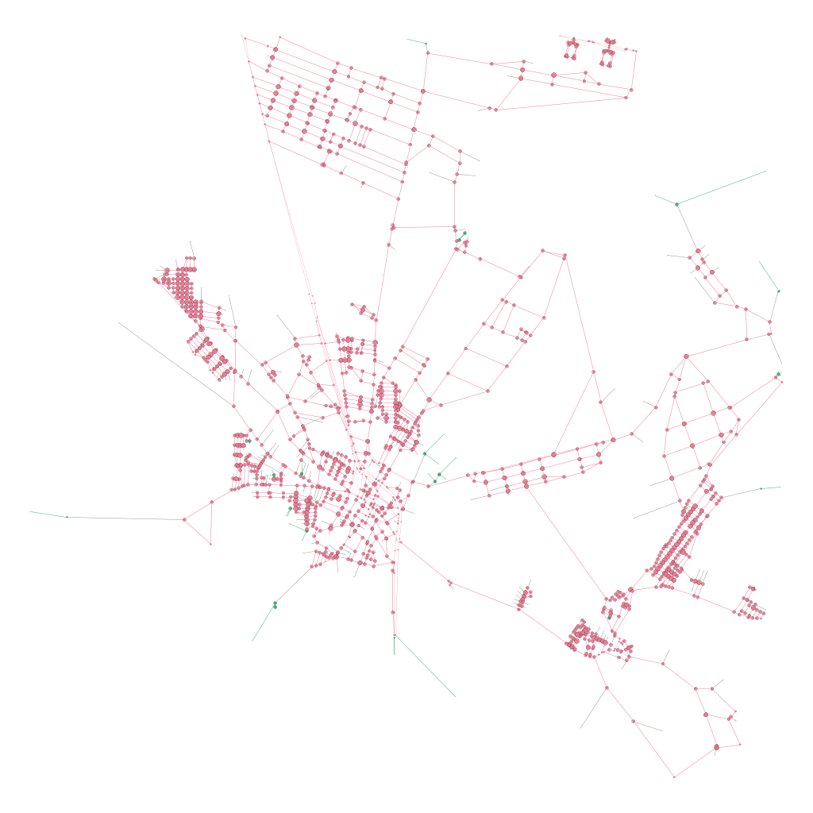
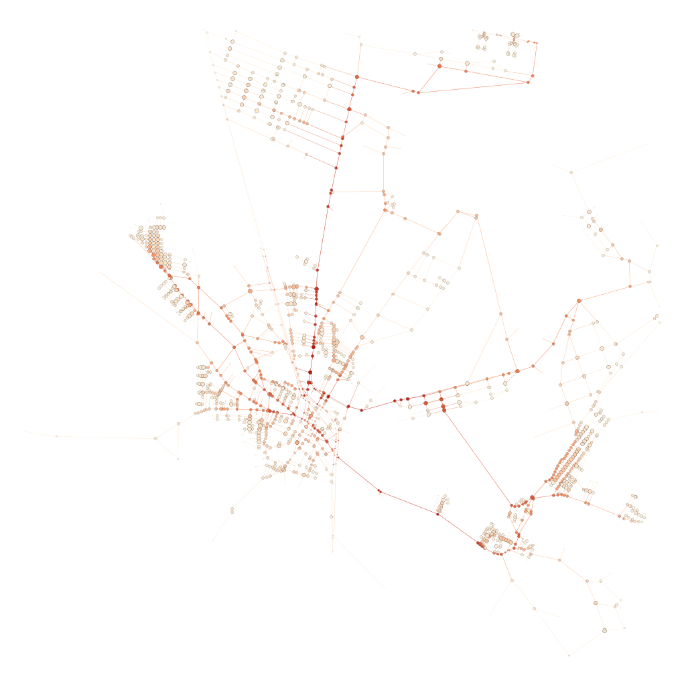
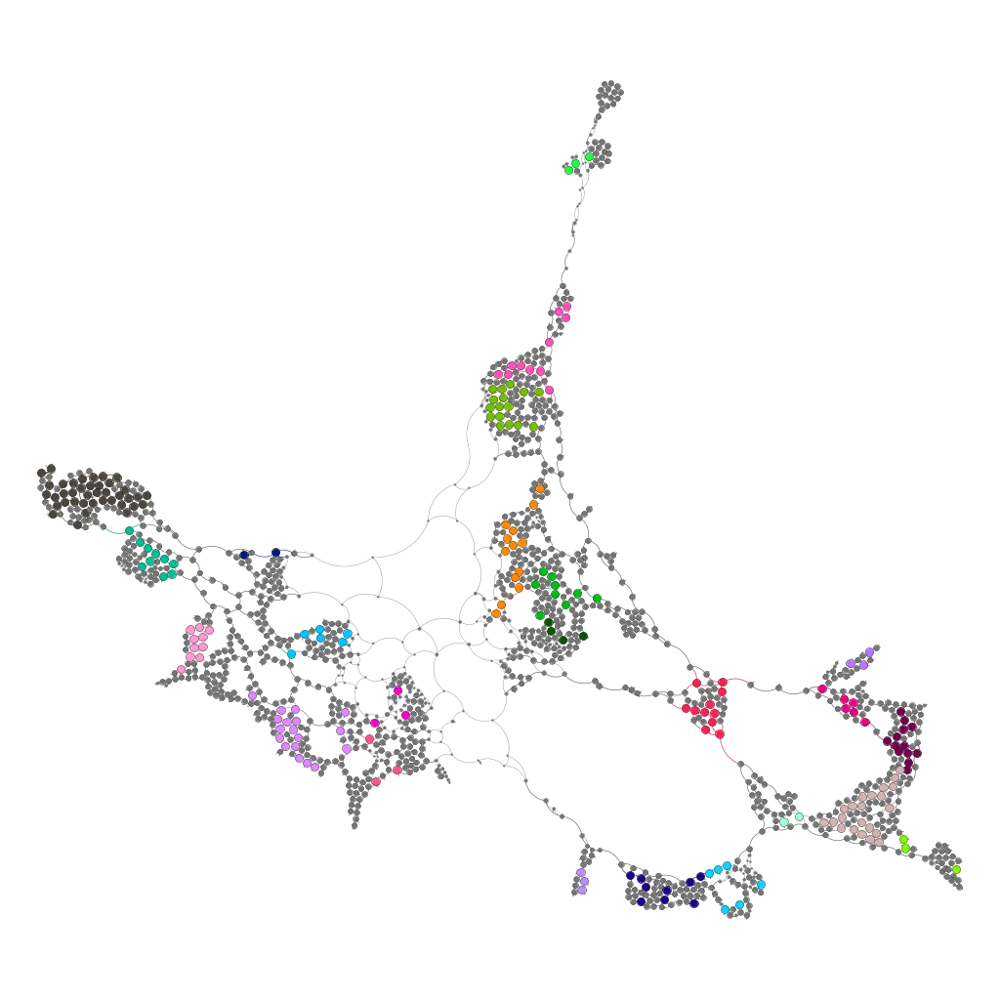
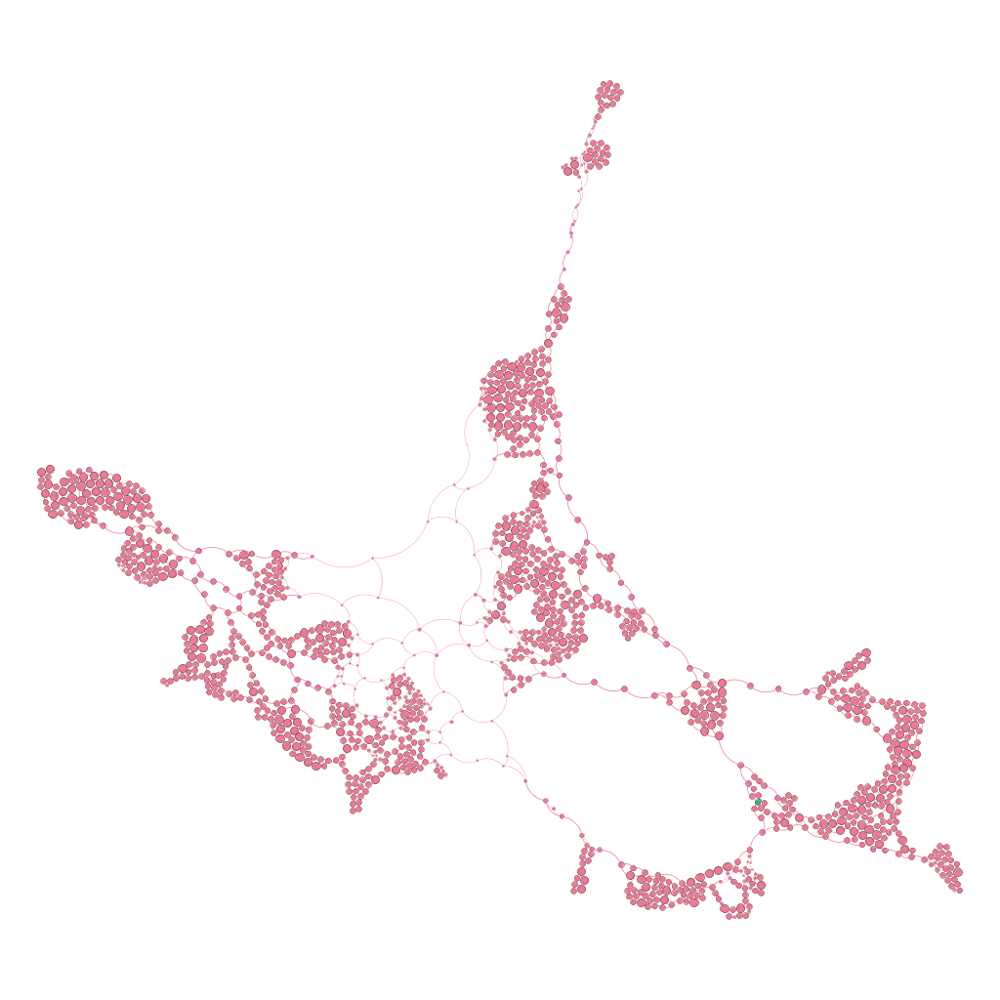

# Análise de Mobilidade Urbana com OSMnx e NetworkX

## Autores
* [Henrique Eduardo Costa da Silva](https://github.com/HenriqueEduardo1)
* [Murilo de Lima Barros](https://github.com/MuriloBarros304)
* [Ramon Vinicius Ferreira de Souza](https://github.com/ramonvfs)

## Identificação da Região Analisada

* **Localidade:** São José de Mipibu, Rio Grande do Norte, Brasil.
* O município localizado na grande Natal possui cerca de 50000 habitantes, foi escolhido por ter 
um tamanho adequado, o que facilita a visualização e o processamento dos dados, além de ser a 
cidade onde residem dois integrantes do grupo.
## Link da Apresentação

* **Vídeo:** [Inserir o link ***DO LOOM DESSA VEZ*** do vídeo de apresentação aqui]

## Objetivo do Trabalho

Para analisar a mobilidade urbana de uma cidade, técnicas usando centralidades em grafos são 
formas matematicamente confiáveis para obter-se insights importantes sobre importância de vias 
e caminhos, por exemplo. O objetivo deste trabalho é apresentar uma análise do fluxo da cidade 
usando grafos, mais especificamente utilizando centralidades, e outros métodos como K-Core, assim 
propondo uma visualização analítica sobre a topologia das vias.

## Metodologia

* **Extração de Dados:** Obtenção do grafo espacial via biblioteca OSMnx utilizando coordenadas 
geográficas/nome do local.
* **Processamento e Estruturação:**
* Uso de grafos direcionados (`MultiDiGraph`) para análises de fluxo com os pesos baseados no 
comprimento das vias.
* Conversão para grafos simples e não direcionados para análises de núcleo (como K-core).

* **Análise Topológica:** Aplicação de algoritmos da biblioteca NetworkX.
* **Visualização:** Geração de mapas de calor no Python (Matplotlib) e exportação do arquivo 
`.graphml` para renderização no Gephi.

## Métricas Calculadas

[tabela]

* **Número de Nós (Interseções):** 1585
* **Número de Arestas (Vias):** 4357
* **Grau Médio:** 5.5
* **Hubs Principais (Top 3 por Grau):**  
(1371092853, 8), (1371092880, 8), (1371092882, 8)
* **K-core Máximo:** 2
* **Nós no Núcleo Principal (K-core):** 1376

## Principais Visualizações

Abaixo estão as representações geradas via Gephi para a análise topológica de São José de Mipibu. Foram utilizados o **Geo Layout** (para preservar a fidelidade espacial) e o **ForceAtlas2** (layout de força estrutural para aproximar nós fortemente conectados).

### 1. Visão Real e Densidade Estrutural (K-Core)

* **Métricas Usadas:** Layout Geográfico (Lat/Lon). Tamanho do nó: `degree_centrality` (Grau). Cor do nó: `k_core` (Partition).
* **Análise:** Esta imagem apresenta o esqueleto viário da cidade sobre o espaço físico. O tamanho destaca os cruzamentos mais movimentados (hubs), enquanto as cores separam os nós por camadas de coesão (K-Core). O núcleo duro (K-Core máximo) revela as regiões onde a malha é fortemente interconectada e oferece múltiplas vias de escape, concentrando-se fortemente no centro urbano, enquanto as bordas com cores diferentes representam ruas isoladas ou rodovias de acesso singular.

### 2. Pontes e Gargalos (Betweenness Centrality)

* **Métricas Usadas:** Layout Geográfico. Tamanho do nó: `degree_centrality` (Grau). Cor do nó (Heatmap): `betweenness_centrality` (Gradiente).
* **Análise:** Apesar de termos cruzamentos com alto Grau no centro do município, o gradiente térmico de betweenness evidencia artérias cruciais por onde quase todos os caminhos precisam obrigatoriamente passar — as "pontes" viárias que conectam grandes bolsões do município. Áreas/vias que adquirem coloração "quente" nesta visualização são críticos para o tráfego: se interrompidas, dividem drasticamente a mobilidade do município, evidenciando o padrão de rodovias e estradas centrais alongadas.

### 3. Principais Distribuidores de Fluxo (Filtro: Top 10% Grau)

* **Métricas Usadas:** Layout Estrutural (ForceAtlas2). Tamanho do nó: `degree_centrality`. Destaque de cor sobre nós base (cinza). Filtro: `degree_centrality` isolando o decil superior (aprox. 10% maiores do grafo).
* **Análise:** Este destaque isola puramente as maiores estrelas da rede (os gigantes distribuidores). Com a atração topológica do ForceAtlas2, fica evidente que os grandes hubs de São José de Mipibu se atraem mutuamente formando um "núcleo duro" e muito conectado entre si, em vez de ficarem espalhados aleatoriamente pelas periferias, confirmando a alta dependência de cruzamentos centrais.

### 4. A Malha Coesa Livre de Ruídos (Filtro: K-Core = 2)

* **Métricas Usadas:** Layout Estrutural (ForceAtlas2). Filtro topológico: Exibição restrita a nós com `k_core = 2` estrutural estrito. 
* **Análise:** A decomposição K-Core aplicada rigorosamente isola a parte coesa viável da rede. Ao descartar o subgrafo k=1, eliminamos completamente as "folhas" da árvore: todas as ruas ou chácaras sem saída. O que sobra é a verdadeira rede circulante da localidade — a matriz pela qual é possível fazer voltas fechadas, circuitos de logísticas urbanas e rotas alternativas de ônibus, confirmando o centro maduro e excluindo braços habitacionais mais recentes/lineares.

## Respostas às Questões Obrigatórias

**1. Os nós com maior grau coincidem com os nós de maior betweenness?**
[Inserir resposta. Discutir se os cruzamentos com mais vias conectadas são de fato os mesmos que 
concentram o fluxo da cidade de um lado para o outro, ou se há vias de menor grau que funcionam 
como gargalos obrigatórios.]

**2. O núcleo identificado pelo k-core coincide com os principais hubs?**
[Inserir resposta. Analisar se o 2-core (ou núcleo máximo identificado) engloba os maiores hubs 
ou se deixa algum hub importante de fora por estar em uma região mais periférica/arborescente.]

**3. O que a métrica de betweenness revela que o grau não revela?**
[Inserir resposta. Explicar como o betweenness identifica vias que servem de "ponte" entre 
diferentes bairros ou regiões desconectadas, mesmo que essas vias sejam retas longas com poucos 
cruzamentos (baixo grau).]

**4. O que muda quando a rede é analisada em sua posição geográfica real e quando é analisada 
por um layout estrutural?**
[Inserir resposta. Comparar as coordenadas reais (latitude/longitude do OSMnx) com os layouts 
do Gephi (ex: ForceAtlas2), explicando como o layout estrutural aproxima comunidades altamente 
conectadas, ignorando a distância física real.]

**5. Existem regiões críticas para mobilidade urbana na área analisada?**
[Inserir resposta. Identificar as artérias principais apontadas pelos mapas de calor e discutir 
possíveis pontos de engarrafamento ou vias onde a interrupção causaria colapso no fluxo.]

**6. A rede parece homogênea ou apresenta concentração estrutural?**
[Inserir resposta. Avaliar se o traçado é uma grade simétrica (como cidades planejadas) ou se 
possui centros densos e periferias esparsas.]

**7. Os resultados obtidos fazem sentido considerando o conhecimento urbano da região escolhida?**
[Inserir resposta. Validar os dados matemáticos com a realidade física de São José de Mipibu, 
verificando se as vias com maior betweenness correspondem às rodovias ou avenidas centrais 
conhecidas do município.]

## Principais Conclusões

[Inserir de 2 a 3 parágrafos fechando o raciocínio do trabalho. Sintetizar como as métricas do 
NetworkX ajudaram a revelar a estrutura invisível da cidade e quais foram os achados mais 
surpreendentes sobre a topologia da malha viária analisada.]