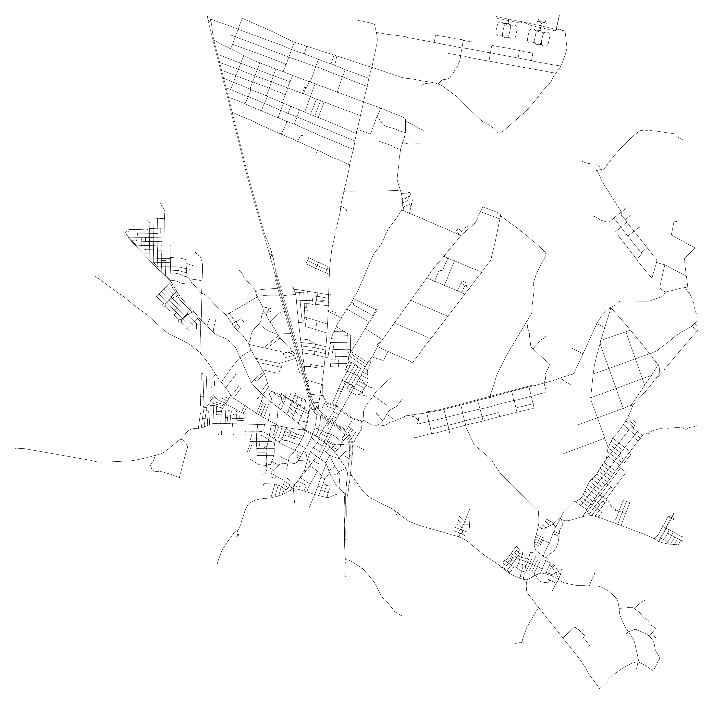
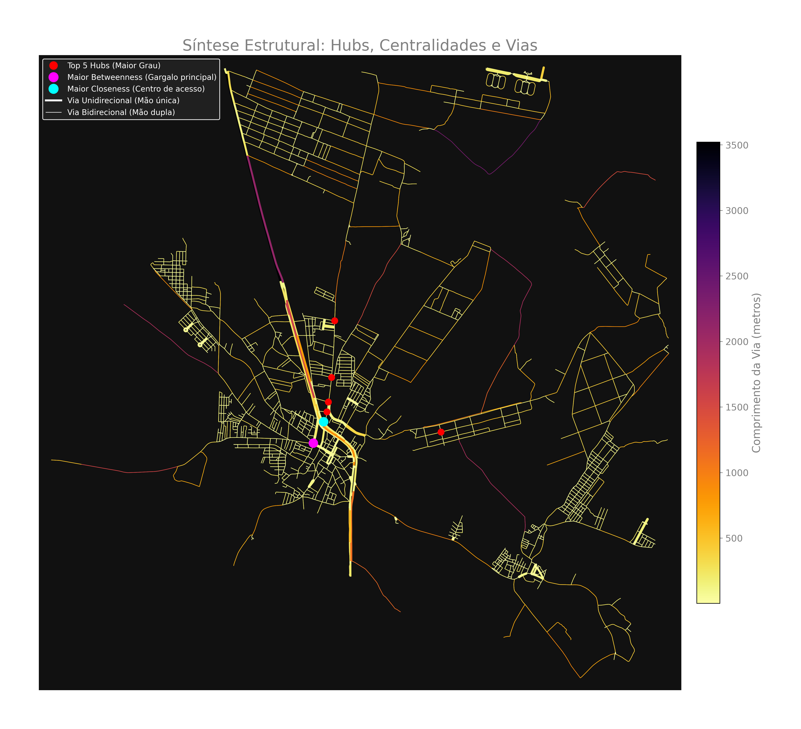

# Análise de Mobilidade Urbana com OSMnx e NetworkX

## Autores
* [Henrique Eduardo Costa da Silva](https://github.com/HenriqueEduardo1)
* [Murilo de Lima Barros](https://github.com/MuriloBarros304)
* [Ramon Vinicius Ferreira de Souza](https://github.com/ramonvfs)

## Identificação da Região Analisada

* **Localidade:** São José de Mipibu, Rio Grande do Norte, Brasil.
* O município localizado na grande Natal possui cerca de 50000 habitantes, foi escolhido por ter 
um tamanho adequado, o que facilita a visualização e o processamento dos dados, além de ser a 
cidade onde residem dois integrantes do grupo.

É importante destacar que o centro de Nísia Floresta também é visível no mapa acima. 
A proximidade das duas cidades permite que em uma única imagem, com raio relativamente 
pequeno, mostre os centros de São José e Nísia, com a primeira na parte esquerda e a 
segunda na parte direita da imagem. Vale lembrar também que nem toda a extensão territorial 
das duas cidades estão contidas na imagem, para São José tem-se o centro e bairros próximos, 
para Nísia contém-se apenas a região central e as proximidades da Lagoa do Bonfim.

## Link da Apresentação

* **Vídeo:** [Inserir o link ***DO LOOM DESSA VEZ*** do vídeo de apresentação aqui]

## Objetivo do Trabalho

Para analisar a mobilidade urbana de uma cidade, técnicas usando centralidades em grafos são 
formas matematicamente confiáveis para obter-se insights importantes sobre importância de vias 
e caminhos, por exemplo. O objetivo deste trabalho é apresentar uma análise do fluxo da cidade 
usando grafos, mais especificamente utilizando centralidades, e outros métodos como K-Core, assim 
propondo uma visualização analítica sobre a topologia das vias.

### Introdução

* Top Hubs, Closeness e Betweenness, distâncias e direções  
Na imagem, nota-se que as maiores centralidades estão coladas com a BR 101, que é a maior via 
unidirecional, em contraste com o restante da cidade que possui vias em grande maioria bidirecional 
(duas mãos). Além disso, as distâncias se mantém curtas, com excessão de alguns trechos da BR e outras 
vias periféricas.

## Metodologia

* **Extração de Dados:** Obtenção do grafo espacial via biblioteca OSMnx utilizando coordenadas 
geográficas/nome do local.
* **Processamento e Estruturação:**
* Uso de grafos direcionados (`MultiDiGraph`) para análises de fluxo com os pesos baseados no 
comprimento das vias.
* Conversão para grafos simples e não direcionados para análises de núcleo (como K-core).

* **Análise Topológica:** Aplicação de algoritmos da biblioteca NetworkX.
* **Visualização:** Geração de mapas de calor no Python (Matplotlib) e exportação do arquivo 
`.graphml` para renderização no Gephi.

## Métricas Calculadas

[tabela]

* **Número de Nós (Interseções):** 1585
* **Número de Arestas (Vias):** 4357
* **Grau Médio:** 5.5
* **Hubs Principais (Top 3 por Grau):**  
(1371092853, 8), (1371092880, 8), (1371092882, 8)
* **K-core Máximo:** 2
* **Nós no Núcleo Principal (K-core):** 1376

## Principais Visualizações

Abaixo estão as representações geradas via Gephi para a análise topológica de São José de Mipibu. Foram utilizados o **Geo Layout** (para preservar a fidelidade espacial) e o **ForceAtlas2** (layout de força estrutural para aproximar nós fortemente conectados).

### 1. Visão Real e Densidade Estrutural (K-Core)

* **Métricas Usadas:** Layout Geográfico (Lat/Lon). Tamanho do nó: `degree_centrality` (Grau). Cor do nó: `k_core` (Partition).
* **Análise:** Esta imagem apresenta o esqueleto viário da cidade sobre o espaço físico. O tamanho destaca os cruzamentos mais movimentados (hubs), enquanto as cores separam os nós por camadas de coesão (K-Core). O núcleo duro (K-Core máximo) revela as regiões onde a malha é fortemente interconectada e oferece múltiplas vias de escape, concentrando-se fortemente no centro urbano, enquanto as bordas com cores diferentes representam ruas isoladas ou rodovias de acesso singular.

### 2. Pontes e Gargalos (Betweenness Centrality)

* **Métricas Usadas:** Layout Geográfico. Tamanho do nó: `degree_centrality` (Grau). Cor do nó (Heatmap): `betweenness_centrality` (Gradiente).
* **Análise:** Apesar de termos cruzamentos com alto Grau no centro do município, o gradiente térmico de betweenness evidencia artérias cruciais por onde quase todos os caminhos precisam obrigatoriamente passar — as "pontes" viárias que conectam grandes bolsões do município. Áreas/vias que adquirem coloração "quente" nesta visualização são críticos para o tráfego: se interrompidas, dividem drasticamente a mobilidade do município, evidenciando o padrão de rodovias e estradas centrais alongadas.

### 3. Principais Distribuidores de Fluxo (Filtro: Top 10% Grau)

* **Métricas Usadas:** Layout Estrutural (ForceAtlas2). Tamanho do nó: `degree_centrality`. Destaque de cor sobre nós base (cinza). Filtro: `degree_centrality` isolando o decil superior (aprox. 10% maiores do grafo).
* **Análise:** Este destaque isola puramente as maiores estrelas da rede (os gigantes distribuidores). Com a atração topológica do ForceAtlas2, fica evidente que os grandes hubs de São José de Mipibu se atraem mutuamente formando um "núcleo duro" e muito conectado entre si, em vez de ficarem espalhados aleatoriamente pelas periferias, confirmando a alta dependência de cruzamentos centrais.

### 4. A Malha Coesa Livre de Ruídos (Filtro: K-Core = 2)

* **Métricas Usadas:** Layout Estrutural (ForceAtlas2). Filtro topológico: Exibição restrita a nós com `k_core = 2` estrutural estrito. 
* **Análise:** A decomposição K-Core aplicada rigorosamente isola a parte coesa viável da rede. Ao descartar o subgrafo k=1, eliminamos completamente as "folhas" da árvore: todas as ruas ou chácaras sem saída. O que sobra é a verdadeira rede circulante da localidade — a matriz pela qual é possível fazer voltas fechadas, circuitos de logísticas urbanas e rotas alternativas de ônibus, confirmando o centro maduro e excluindo braços habitacionais mais recentes/lineares.

## Respostas às Questões Obrigatórias

**1. Os nós com maior grau coincidem com os nós de maior betweenness?**
Não necessariamente. Os nós com maior grau representam os cruzamentos com mais conexões diretas, 
ou seja, pontos importantes localmente dentro da malha viária. Porém, os maiores valores de 
`betweenness_centrality` aparecem também em nós com grau menor, como grau 3 ou 4, porque esses 
nós funcionam como passagens obrigatórias entre diferentes regiões da rede. Assim, um cruzamento 
pode não ter muitas ruas conectadas a ele e, ainda assim, concentrar grande parte dos caminhos 
mínimos entre bairros ou setores da cidade. Na prática, o grau identifica hubs locais, enquanto 
a betweenness identifica gargalos globais de fluxo.

**2. O núcleo identificado pelo k-core coincide com os principais hubs?**
Em grande parte, sim. Os principais hubs por grau estão dentro do núcleo máximo encontrado, que 
foi o `k-core = 2`. Isso indica que esses cruzamentos fazem parte da porção mais conectada e 
circulável da rede. Entretanto, o k-core não deve ser interpretado como uma lista de hubs: ele 
mede coesão estrutural, não apenas quantidade de conexões. Como 1376 dos 1585 nós pertencem ao 
`k-core = 2`, esse núcleo representa uma malha urbana ampla, retirando principalmente ruas sem 
saída, ramificações periféricas e trechos com baixa redundância de caminhos.

**3. O que a métrica de betweenness revela que o grau não revela?**
A betweenness revela quais nós e trechos atuam como pontes entre partes diferentes da cidade. 
Enquanto o grau mede apenas quantas conexões diretas um cruzamento possui, a betweenness mede 
quantos caminhos mínimos passam por ele. Por isso, ela consegue destacar vias estruturantes, 
corredores de acesso, trechos próximos à BR-101 e ligações entre bairros que podem ter baixo grau, 
mas alta importância para o deslocamento geral. Essa métrica é especialmente útil para identificar 
pontos onde uma interrupção causaria grande impacto na mobilidade.

**4. O que muda quando a rede é analisada em sua posição geográfica real e quando é analisada 
por um layout estrutural?**
Na visualização geográfica, os nós são posicionados por latitude e longitude, preservando a forma 
real da cidade. Isso permite observar onde ficam fisicamente o centro urbano, as vias longas, os 
bairros periféricos e os acessos principais. Já no layout estrutural, como o ForceAtlas2, a posição 
real é substituída por uma organização baseada nas conexões do grafo. Nós e grupos mais conectados 
entre si são aproximados, mesmo que estejam distantes no mapa real. Portanto, o mapa geográfico 
ajuda a interpretar a cidade como espaço físico, enquanto o layout estrutural ajuda a enxergar 
comunidades, hubs e dependências topológicas.

**5. Existem regiões críticas para mobilidade urbana na área analisada?**
Sim. As regiões críticas aparecem principalmente nos corredores com alta betweenness, próximos às 
vias estruturantes e aos acessos que conectam diferentes bolsões urbanos. A análise indica que 
trechos próximos à BR-101 e às vias centrais exercem papel importante no fluxo, pois concentram 
caminhos entre áreas distintas da rede. Se esses pontos forem bloqueados ou congestionados, muitos 
deslocamentos passam a depender de rotas alternativas mais longas ou menos diretas. Isso mostra 
que a mobilidade local depende de alguns eixos principais, e não apenas da quantidade de cruzamentos 
em cada ponto.

**6. A rede parece homogênea ou apresenta concentração estrutural?**
A rede apresenta concentração estrutural. Ela não se comporta como uma grade regular e homogênea, 
pois existem áreas centrais mais densas, vias longas de ligação e regiões periféricas com 
ramificações mais esparsas. A distribuição do k-core reforça essa interpretação: a maior parte dos 
nós está no `k-core = 2`, formando a malha circulável principal, enquanto os nós de `k-core = 1` 
representam pontas, acessos isolados e ruas com menor redundância. Essa estrutura é típica de uma 
cidade que cresceu em torno de eixos viários e de um centro urbano mais consolidado.

**7. Os resultados obtidos fazem sentido considerando o conhecimento urbano da região escolhida?**
Sim. Os resultados são coerentes com a estrutura urbana de São José de Mipibu e com a presença de 
vias de grande importância regional, especialmente a BR-101 e os acessos centrais próximos a ela. 
Os hubs por grau aparecem em áreas com maior quantidade de cruzamentos, enquanto os maiores valores 
de betweenness destacam pontos que conectam regiões diferentes da cidade. Essa diferença faz sentido 
para uma malha viária formada por um centro mais denso, bairros conectados por eixos principais e 
áreas periféricas menos integradas. Portanto, as métricas calculadas não apenas produzem números, 
mas ajudam a explicar características reais da mobilidade local.

## Principais Conclusões

A análise da malha viária de São José de Mipibu mostrou que as métricas de grafos permitem enxergar 
uma estrutura que não aparece de forma imediata apenas olhando o mapa. Com o NetworkX, foi possível 
separar diferentes tipos de importância: o grau destacou os cruzamentos mais conectados, a closeness 
indicou pontos com boa acessibilidade geral, a betweenness revelou gargalos de circulação e o k-core 
mostrou a parte mais coesa e redundante da rede. Dessa forma, a cidade pôde ser interpretada não 
apenas como um conjunto de ruas, mas como uma rede com centros, pontes, dependências e regiões mais 
ou menos resilientes.

Um dos achados mais relevantes foi perceber que os principais hubs por grau não coincidem 
necessariamente com os maiores gargalos de fluxo. Alguns nós com poucas conexões diretas aparecem 
com alta betweenness porque ocupam posições estratégicas entre diferentes setores da cidade. Isso 
mostra que, em uma análise de mobilidade urbana, cruzamentos aparentemente simples podem ter grande 
importância operacional. A presença da BR-101 e de vias centrais alongadas reforça esse padrão, pois 
elas funcionam como eixos de ligação entre áreas densas, bairros periféricos e acessos regionais.

O k-core máximo igual a 2 também revelou uma característica importante da rede: a cidade possui uma 
malha circulável ampla, mas com baixa profundidade de núcleo quando comparada a redes urbanas mais 
densas e regulares. A maior parte dos nós pertence ao núcleo principal, enquanto os nós fora dele 
representam ramificações, ruas sem saída e acessos menos integrados. Assim, a topologia analisada 
aponta para uma cidade com centro relativamente consolidado, dependência de alguns corredores 
estruturantes e periferias mais esparsas, o que torna as vias de ligação especialmente críticas para 
a mobilidade local.
